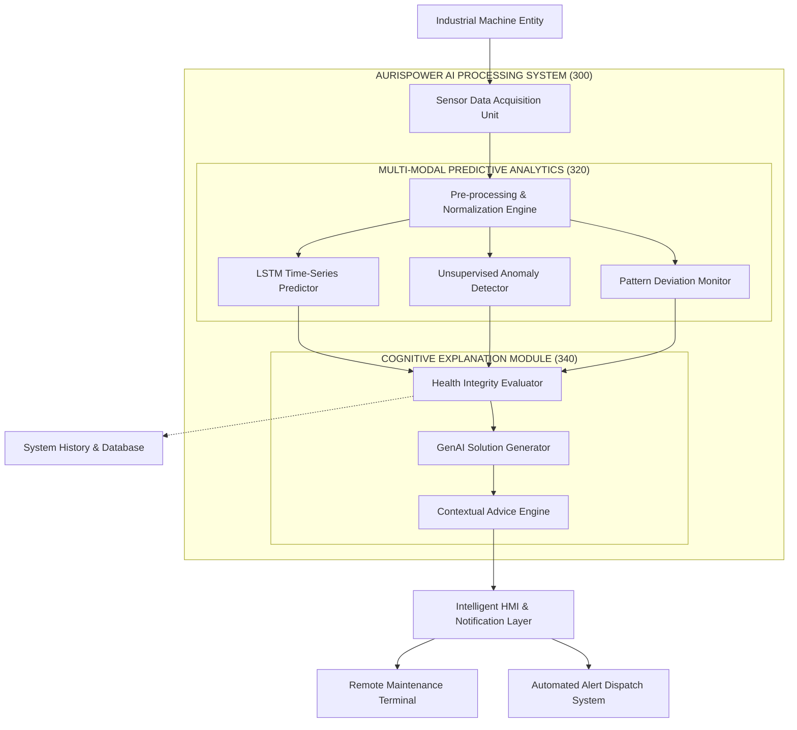

# Patent Documentation: Figure 1 - System Block Diagram

This document provides a formalized block diagram and description of the AurisPower Machine Error Prediction system, structured for inclusion in a patent application.

## Figure 1: Functional Block Diagram

## Detailed Description of Functional Elements

| Reference No. | Functional Block | Description |
| :--- | :--- | :--- |
| **100** | Industrial Machine Entity | The primary hardware (motors, transformers, electrical panels) being monitored. |
| **200** | Sensor Data Acquisition Unit | Captures electrical parameters (Voltage, Current) and environmental data (Temperature, Vibration). |
| **300** | AI Processing System | The core computational framework for analyzing telemetry data. |
| **310** | Pre-processing Engine | Filters noise and normalizes multi-modal data for machine learning model ingestion. |
| **320** | Predictive Analytics | An ensemble of neural networks and ML models for fault identification. |
| **322** | LSTM Predictor | Analyzes temporal dependencies to forecast future equipment failure states. |
| **324** | Anomaly Detector | Identifies statistical outliers that deviate from established "Golden Run" operating baselines. |
| **326** | Pattern Deviation Monitor | Compares real-time operating signatures against theoretical digital twin models. |
| **330** | Health Integrity Evaluator | Synthesizes outputs from all ML models to determine overall system health score. |
| **340** | Cognitive Explanation | Translates numerical ML predictions into actionable human intelligence. |
| **342** | GenAI Solution Generator | Maps specific fault signatures to a database of corrective engineering procedures. |
| **344** | Contextual Advice Engine | Customizes maintenance alerts based on the specific industrial environment and severity. |
| **400** | HMI & Notification Layer | The interface (Dashboard/Mobile) through which human operators interact with the AI. |
| **420** | Alert Dispatch System | Automatically routes critical maintenance drafts and alerts to relevant engineering personnel. |
| **500** | System History / Database | Persistent storage for historical fault events, audit logs, and retraining data (MongoDB). |

## Claim Summary (Novel Aspects)
1.  **Hybrid Predictive Architecture**: Leveraging concurrent LSTM (temporal) and Anomaly Detection (contextual) models.
2.  **Autonomous Solution Generation**: A cognitive layer that bridges the gap between raw ML fault codes and detailed, procedural maintenance instructions.
3.  **Closed-Loop Digital Twin**: Real-time evaluation of healthy vs. faulty operating patterns for proactive (Phase 0) intervention.
